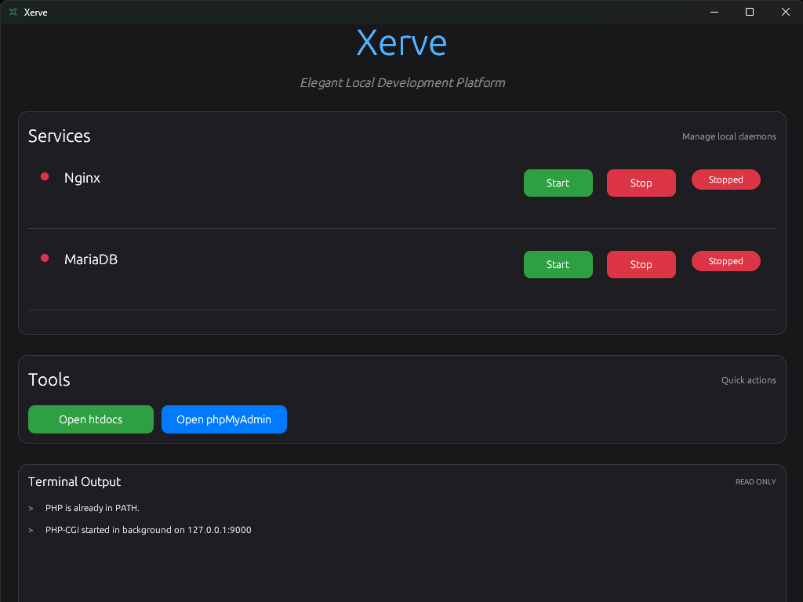

  
  
  <h1>Xerve</h1>
  
  
<strong>A lightweight local development platform for running and managing development services</strong>

  

    
    
    
    
    
    
    
    
    
    
  

  

    <a href="#features">Features</a> •
    <a href="#installation">Installation</a> •
    <a href="#usage">Usage</a> •
    <a href="#screenshots">Screenshots</a> •
    <a href="#contributing">Contributing</a>
  

 

## 🌟 Overview

Xerve is a modern, Rust-based application that provides an elegant graphical interface for managing local development services such as Nginx and MariaDB. It simplifies the process of starting, stopping, and monitoring these services through an intuitive user interface with real-time terminal output.

With Xerve, you can effortlessly manage your local development environment without the complexity of command-line tools or configuration files.

 

## ✨ Features

### 🚀 Service Management

  <ul>
    <li><strong>Nginx Integration</strong> - Start, stop, and monitor your local Nginx web server</li>
    <li><strong>MariaDB Integration</strong> - Manage your local MariaDB database server</li>
    <li><strong>Automatic Initialization</strong> - MariaDB data directory is automatically created and initialized if not present</li>
    <li><strong>Process Tracking</strong> - Services are tracked by process ID for reliable management</li>
  </ul>

### 🖥️ Beautiful User Interface

  <ul>
    <li><strong>Modern Dark Theme</strong> - Sleek dark interface with carefully chosen colors for reduced eye strain</li>
    <li><strong>Real-time Status Monitoring</strong> - Visual indicators show the current status of each service</li>
    <li><strong>Integrated Terminal</strong> - Real-time terminal output showing all process logs directly in the UI</li>
    <li><strong>One-click Controls</strong> - Simple Start/Stop buttons for each service</li>
  </ul>

### 🔧 System Integration

  <ul>
    <li><strong>Graceful Shutdown</strong> - All services are automatically stopped when the application exits</li>
    <li><strong>Enhanced Error Handling</strong> - Comprehensive error handling with clear feedback to the user</li>
    <li><strong>Resource Management</strong> - Proper cleanup of resources when services are stopped</li>
    <li><strong>Atomic Operations</strong> - Service status operations are thread-safe to prevent race conditions</li>
  </ul>

 

## 📦 Prerequisites

  <ul>
    <li><strong>Windows 10/11</strong> (currently focused on Windows support)</li>
    <li><strong>Rust toolchain</strong> (for building from source)</li>
  </ul>

 

## 🛠️ Installation

### 📥 Download Pre-built Binary

  <ol>
    <li>Download the latest release from the <a href="https://github.com/FANNYMU/xerve/releases">Releases page</a></li>
    <li>Extract the archive to your preferred location</li>
  </ol>

### 🔧 Build from Source

  <ol>
    <li>Clone the repository:
      <pre><code>git clone https://github.com/FANNYMU/xerve.git</code></pre>
    </li>
    <li>Navigate to the project directory:
      <pre><code>cd xerve</code></pre>
    </li>
    <li>Install dependencies and build:
      <pre><code>cargo build --release</code></pre>
    </li>
    <li>Download and extract Nginx and MariaDB to the <code>resource</code> directory:
      <ul>
        <li>Nginx should be in <code>resource/nginx/</code></li>
        <li>MariaDB should be in <code>resource/mariadb/</code></li>
      </ul>
    </li>
  </ol>

 

## ▶️ Usage

### Running the Application

  
Run the application with:

  <pre><code>cargo run --release</code></pre>
  
  
Or execute the compiled binary:

  <pre><code>./target/release/xerve.exe</code></pre>

### Using the Interface

  <ol>
    <li><strong>Start Services</strong> - Click the "Start" button next to a service to begin it</li>
    <li><strong>Stop Services</strong> - Click the "Stop" button to gracefully stop a running service</li>
    <li><strong>Monitor Output</strong> - Watch the integrated terminal for real-time process output</li>
    <li><strong>Check Status</strong> - Visual indicators show the current status of each service</li>
  </ol>

 

## 📸 Screenshots

### Main Interface

  
  
<em>The elegant main interface showing service controls and integrated terminal output</em>

 

## 🔨 Building

To build Xerve for release:

<pre><code>cargo build --release</code></pre>

The executable will be located at <code>target/release/xerve.exe</code>.

 

## 🤝 Contributing

Contributions are welcome! Here's how you can help:

  <ol>
    <li><strong>Fork the repository</strong></li>
    <li><strong>Create your feature branch</strong>
      <pre><code>git checkout -b feature/AmazingFeature</code></pre>
    </li>
    <li><strong>Commit your changes</strong>
      <pre><code>git commit -m 'Add some AmazingFeature'</code></pre>
    </li>
    <li><strong>Push to the branch</strong>
      <pre><code>git push origin feature/AmazingFeature</code></pre>
    </li>
    <li><strong>Open a Pull Request</strong></li>
  </ol>

### Ways to Contribute

  <ul>
    <li>Report bugs and issues</li>
    <li>Suggest new features</li>
    <li>Improve documentation</li>
    <li>Submit code enhancements</li>
    <li>Add support for new services</li>
  </ul>

 

## 📜 License

This project is licensed under the MIT License - see the <a href="LICENSE">LICENSE</a> file for details.

 

## 🙏 Acknowledgments

We'd like to thank the creators of these amazing technologies that make Xerve possible:

  <ul>
    <li><a href="https://www.rust-lang.org/"><strong>Rust</strong></a> - Systems programming language that powers Xerve</li>
    <li><a href="https://github.com/emilk/egui"><strong>egui</strong></a> - The immediate mode GUI framework used for the interface</li>
    <li><a href="https://nginx.org/"><strong>Nginx</strong></a> - High-performance web server</li>
    <li><a href="https://mariadb.org/"><strong>MariaDB</strong></a> - Open source relational database</li>
  </ul>

 

## 📚 Additional Resources

  <ul>
    <li><a href="CHANGELOG.md"><strong>Changelog</strong></a> - See what's new in each release</li>
    <li><a href="RELEASE.md"><strong>Release Notes</strong></a> - Detailed release information</li>
    <li><a href="https://github.com/FANNYMU/xerve/issues"><strong>Issues</strong></a> - Report bugs or request features</li>
    <li><a href="CONTRIBUTING.md"><strong>Contributing Guide</strong></a> - Learn how to contribute to the project</li>
  </ul>

 

  <strong>Made with ❤️ by FANNYMU, for developers</strong>

